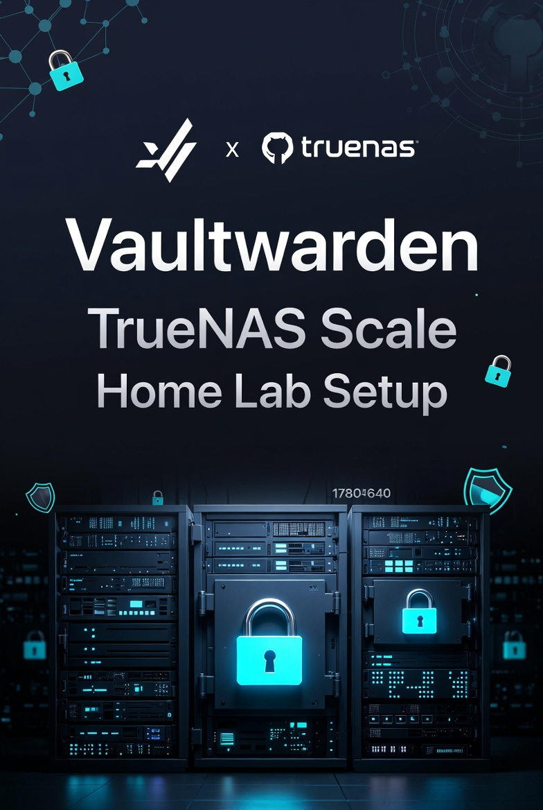

# Vaultwarden on TrueNAS Scale

  

**Complete, production-ready Vaultwarden (Bitwarden-compatible)** setup on TrueNAS Scale with automated encrypted backups, Nginx Proxy Manager, and full VLAN security.

---

## ✨ Key Features

- Family organization with shared collections
- Daily automated GPG-encrypted backups (30-day retention)
- Secure access via Nginx Proxy Manager + Let's Encrypt
- VLAN segmentation (Clients + Tailscale allowed, Guests blocked)
- Full restore documentation

---

## 🚀 Quick Start

1. Follow the **[SETUP-CHECKLIST.md](SETUP-CHECKLIST.md)**
2. Deploy Vaultwarden from TrueNAS Apps
3. Configure Nginx Proxy Manager
4. Set up automated backups

**Total setup time**: ~30–45 minutes

---

## 📸 Screenshots

**Storage Configuration**  

**Nginx Proxy Host**  

**App Settings**  

**SMTP Configuration**  

**Family Organization**  

---

## 📖 Full Documentation

| Document | Description |
|----------|-------------|
| **[SETUP-CHECKLIST.md](SETUP-CHECKLIST.md)** | Step-by-step installation checklist |
| **[edge-router-firewall-rules.md](edge-router-firewall-rules.md)** | All EdgeRouter-4 firewall rules |
| **[docs/restore-guide.md](docs/restore-guide.md)** | Full restore procedure |
| **[docs/vlan-overview.md](docs/vlan-overview.md)** | Homelab VLAN architecture |
| **[scripts/vaultwarden_backup.sh](scripts/vaultwarden_backup.sh)** | Backup script |
| **[ROADMAP.md](ROADMAP.md)** | Future improvements |

---

## 🛡️ Security & Network

- **Allowed**: Clients VLAN (`192.168.30.0/24`) + Tailscale
- **Blocked**: Guest VLAN (`192.168.40.0/24`)
- **SMTP**: Gmail App Password (outbound only)
- **Backups**: Encrypted with GPG AES256

---

## 📝 Roadmap

See [ROADMAP.md](ROADMAP.md) for completed items and future plans.

---

## 🤝 Contributing

Feel free to open issues or submit improvements!

---

## 📄 License

[MIT License](LICENSE) © 2026 Duc Nguyen

---

**Star this repo if it helped you set up your own secure password manager!** 🔐

_Last updated: May 2026_