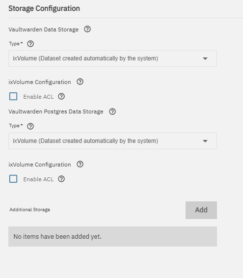
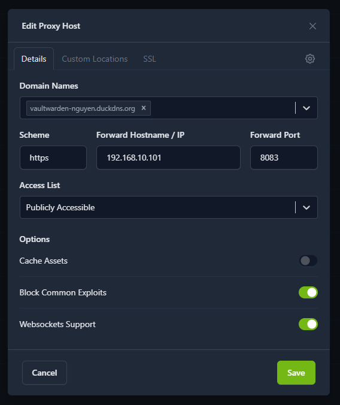
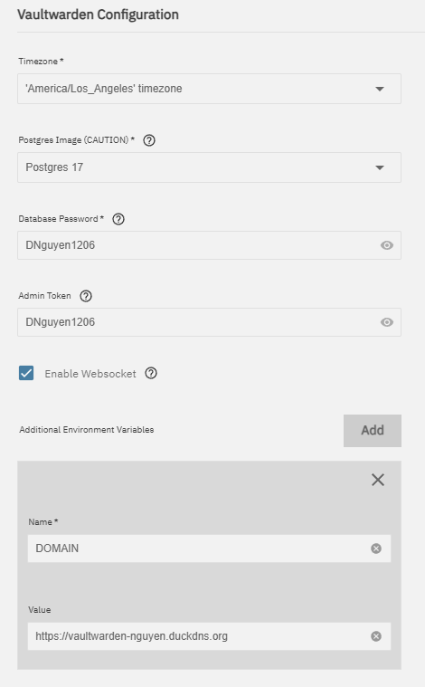
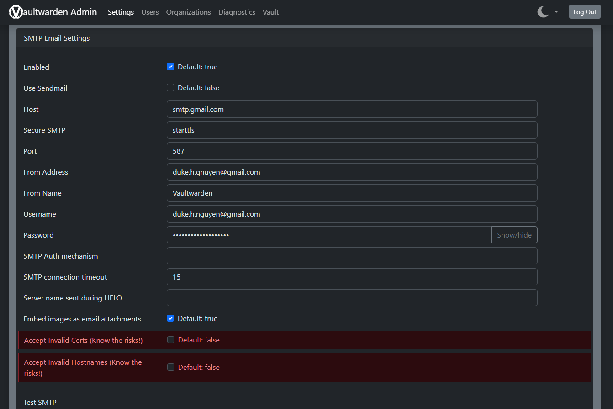
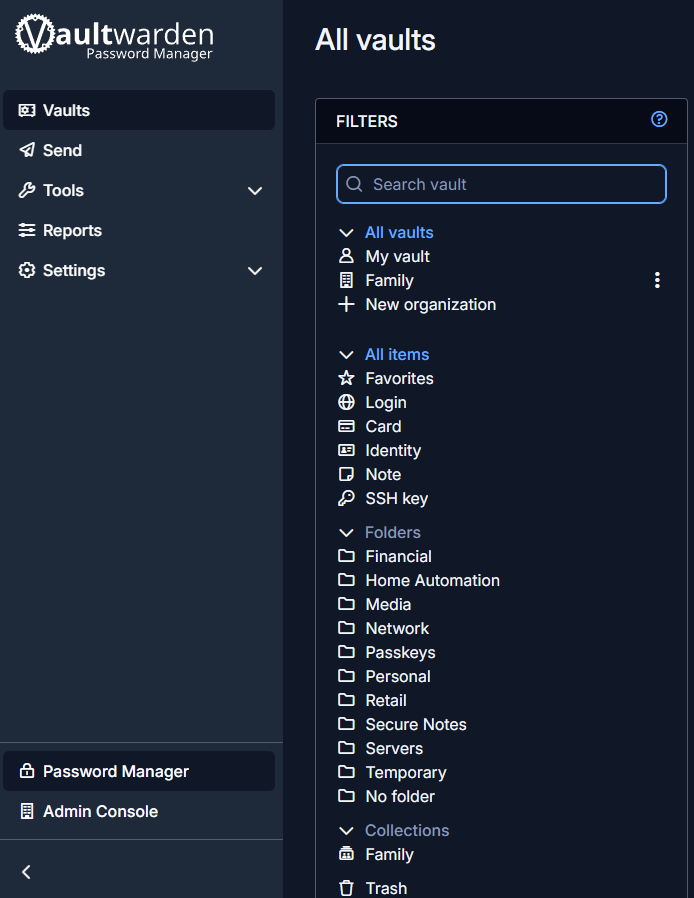

# Vaultwarden on TrueNAS Scale - Home Lab Setup

Complete guide for installing, configuring, and maintaining **Vaultwarden** (Bitwarden-compatible password manager) on my **TrueNAS Scale** server as part of my home lab.

**Last Updated:** April 29, 2026  
**Status:** Completed & Documented

## Screenshots

**Storage Configuration**  

**Nginx Proxy Host**  

**Vaultwarden App Settings**  

**SMTP Configuration**  

**Admin Interface & Organization**  

## Overview

- **Server**: TrueNAS Scale @ `192.168.10.101`
- **Storage Pool**: `DataPool`
- **App Data Path**: `/mnt/DataPool/apps/vaultwarden/data`
- **Public URL**: [https://vaultwarden-nguyen.duckdns.org](https://vaultwarden-nguyen.duckdns.org)
- **Reverse Proxy**: Nginx Proxy Manager
- **Backup**: Daily encrypted GPG backups with 30-day retention

## Table of Contents

- [Installation Steps](#installation-steps)
- [Nginx Reverse Proxy Setup](#nginx-reverse-proxy-setup)
- [SMTP Configuration](#smtp-configuration)
- [Admin Interface & Family Access](#admin-interface--family-access)
- [Automated Backups](#automated-backups)
- [Network & Firewall Rules](#network--firewall-rules)
- [Setup Checklist](SETUP-CHECKLIST.md)
- [Restore Procedure](#restore-procedure)

## Installation Steps

1. Install **Vaultwarden** from **Apps → Available Applications**
2. Use default `ixVolume` for storage
3. Set a strong `ADMIN_TOKEN` environment variable
4. Enable **WebSocket** support

## Nginx Reverse Proxy Setup

- **Domain**: `vaultwarden-nguyen.duckdns.org`
- **Forward Host**: `192.168.10.101`
- **Forward Port**: `8083`
- **Websockets Support**: Enabled
- **SSL**: Let's Encrypt certificate

## SMTP Configuration

Configured in **Vaultwarden Admin UI** (`https://vaultwarden-nguyen.duckdns.org/admin`):

- **Host**: `smtp.gmail.com`
- **Port**: `587`
- **Secure SMTP**: `starttls`
- **From Address / Username**: Your Gmail address
- **Password**: Gmail App Password

## Admin Interface & Family Access

- Enabled via `ADMIN_TOKEN`
- Created **"Nguyen Family"** Organization
- Manually added family members
- Used Collections for secure sharing (Wi-Fi, Streaming Services, etc.)

## Automated Backups

**Script**: [`backup-script/vaultwarden_backup.sh`](backup-script/vaultwarden_backup.sh)

**Features**:
- Daily at 2:00 AM via TrueNAS Cron Job
- Brief pod stop for consistent backup
- Compressed + encrypted with **GPG AES256**
- 30-day retention
- Stored in `/mnt/DataPool/backups/bitwarden/`

## Network & Firewall Rules

- Clients VLAN (`192.168.30.0/24`) → Allowed access via Nginx
- Tailscale (`100.64.0.0/10`) → Full access
- Guest VLAN (`192.168.40.0/24`) → Blocked

## Restore Procedure

1. Decrypt: `gpg -d vaultwarden_backup_*.gpg > backup.tar.gz`
2. Stop Vaultwarden pod
3. Extract to data directory
4. Restart pod
5. Verify access

## Monitoring

- **Netdata**: `http://192.168.10.101:20489`
- **Prometheus + Grafana**
- **Scrutiny** (drive health)

## Home Lab Context

Part of my larger homelab:
- EdgeRouter-4 with 5 VLANs (Management, Servers, IoT, Clients, Guests)
- 5× Raspberry Pi cluster
- TrueNAS Scale with 72TB RAIDZ2
- Full media stack (*arr, Jellyfin, Immich, Frigate, Home Assistant)